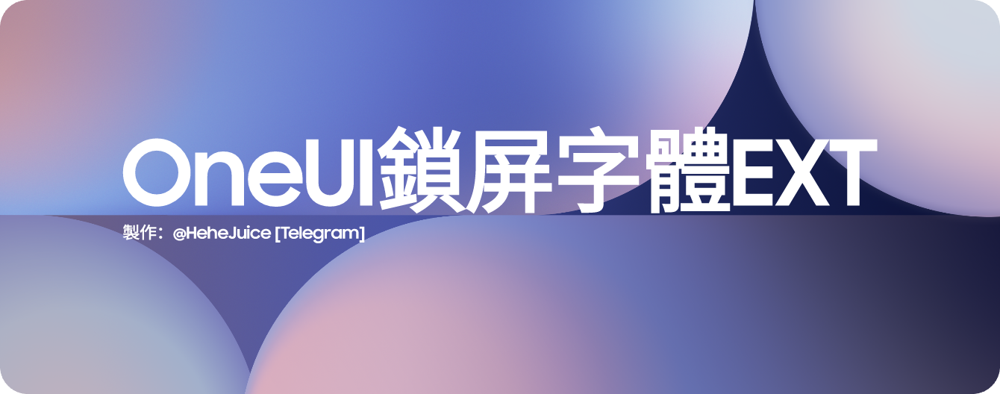

Language : [English](README.md) • 中文 • [Tiếng Việt](README_VI.md)
<h1 align="center">
  
</h1>

# 🗺️ 項目概述
OneUI鎖屏字體EXT（OneUI-Lockscreen-Font-EXT）是一個為 OneUI 鎖定畫面介面添加更多字體的項目

支援版本 OneUI 6 + 

  
    
    

  ### 🤔 它是如何運作的呢？
安裝 ZIP 檔案中的 APK 文件，然後在鎖定畫面編輯器中開啟「更多字型」選項。 

  

 ### 😵 聲明
- 我拒絕製作任何與 iOS 主題相關的東西
- OPPO 大時鐘字體的出現是因為 Android（HyperOS） [October 29, 2024] 比iOS 26 [September 15, 2025] 更早發布了「長時鐘樣式」
因此，在我看來，它屬於 Android 風格
- [更多有關資料](HeheJuice/ResultCN.png)
- 我不討厭 iOS，我有iOS 26的iPad,我不製作 iOS 主題的原因是為了保持 Android 自身的風格。

 ### ℹ️ 現已推出的字體 [鳴謝]
- OPPO 大時鐘字體 [OPPO]
- 鴻蒙字體 Super Bold [華為]
- Bodoni Moda [Owen Earl]
- DM Serif Display [Colophon Foundry]
- Gravitas One [Riccardo De Franceschi]
- CreatoDisplayRegular [Anugrah Pasau]
- CreatoDisplayBold [Anugrah Pasau]
- BadeenDisplay-Regular [Hani Alasadi]
- 谷歌 Pixel Inflate [谷歌]
- 小米 NeuRounded [小米]
- NothingOS NType[Nothing]
- NothingOS NDot [Nothing]
- CookieRunBold [Devsisters]
- MotoMilkyStackedRegular [Motorola]
- RivieraRegular [Johann Darcel]
- Monoton  [vernon adams]
- MiSerifF [小米]

 ### ❤️ 特別鳴謝 
- 感謝所有字體設計師們出色的作品 

 ### ⚠️ 注意事項 
-  如果您打算將此內容分享到您的影片或其他平台，您可以（我們希望,謝謝）添加此 GitHub 鏈接，以確保作者和字體設計師的署名權得到尊重
- HeheJuice 保留本項目的最終解釋權
- 字體創作者保留隨時移除字體的權利
- 如果您想移除字體，請透過以下方式與我聯絡（對於字體設計師）：
   - 電子郵件 : HeheJuiceBomb@gmail.com ［僅回覆字體創建者，其他索取文件的使用者表示您未完整閱讀本網站內容，您的信件將被忽略。 ］

